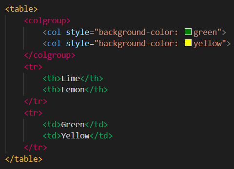
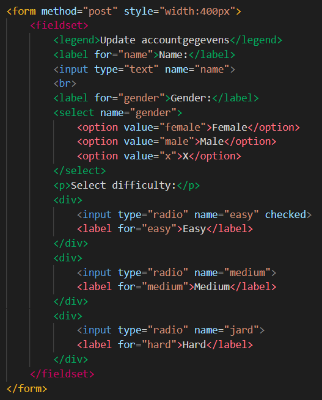
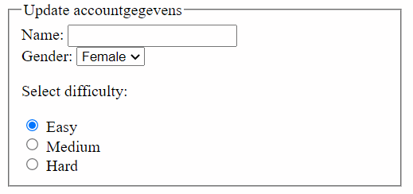
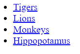
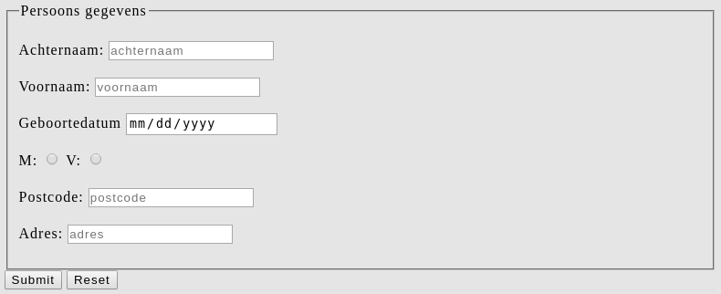

# HTML Recap

# Introductie

Tijdens de selectieperiode heb je al veel geoefend met HTML. Toch zullen we in deze handout nog even kort over de basis heengaan. Ook zal je kennis maken met wat van de meer niche onderdelen van HTML

 

# Inhoud

1. HTML Basics
2. HTML Semantics
3. HTML Accessibility
4. HTML Tables
5. HTML Forms
6. HTML Questions

 

# HTML Basics

Als je nog weinig kennis van HTML hebt, is het handig om jezelf nog wat extra in te lezen. [Hier](https://developer.mozilla.org/en-US/docs/Learn/HTML/Introduction_to_HTML) is een goede link via MDN, en [hier](https://www.w3schools.com/html/default.asp) een goede link van w3schools.

We gaan nog even een voor een de basisonderdelen langs:

 

## **&lt;!DOCTYPE html>**

De _doctype declaratie_ is technisch gesproken geen HTML tag. Het is de manier waarop het document je browser vertelt welke versie van HTML gebruikt wordt. Geschreven zoals hierboven is dat dan HTML5, maar als je om een-of-andere reden expliciet een oudere versie van HTML zou willen gebruiken, dan kan dat hiermee.

_**Feitje**: Als je de doctype declaratie weg laat, gebruikt je browser zijn eigen regels en standaarden om HTML te interpreteren. Hiermee ondersteunt je browser hele oude websites uit de tijd voor de HTML-standaard. Dit wordt ook wel **Quirks Mode** genoemd._

 

## **&lt;html>**

De html tag wordt ook wel het root element genoemd. Dit is waar alles behalve de doctype declaratie in terecht komt. Bij deze tag hoor je altijd de **lang **attribuut gebruiken om de taal van je website in te zetten. Dit zorgt ervoor dat zoekmachines je pagina beter kunnen vinden en dat webbrowsers je pagina indien nodig beter kunnen vertalen.

 

## **&lt;head>**

Dit is waar de meta-informatie staat; dat is informatie over je pagina die er niet zelf op staat. Denk aan bijvoorbeeld de titel van je tabblad, verwijzingen naar externe styling/scripts of informatie over de auteur.

 

## **&lt;body>**

Dit is waar de daadwerkelijke inhoud van je pagina hoort te staan.

 

## **&lt;div>**

Het meestvoorkomende html element. Dit wordt gebruikt om de content van je pagina in te delen, met 1 enkele standaard CSS-waarde: ‘display: block’. Elementen met deze standaard-waarde (zoals divs) worden ook wel _block elements_ genoemd.

 

## **&lt;span>**

Het kleine broertje van de div, met 1 cruciaal verschil. Het heeft namelijk de standaard CSS-waarde: ‘display: inline’ ipv block. Hierdoor wordt het ook wel een _inline element_ genoemd. Vooral gebruikt om text &lt;span>midden in de regel&lt;/span> aan te passen.

 

## **&lt;h1>, &lt;h2>, &lt;h3>, &lt;h4>, &lt;h5> & &lt;h6>**

Deze worden ook wel **headings** genoemd. Ze gaan van groot tot klein - die maten krijgen ze via de standaard CSS en dat is natuurlijk aan te passen. Headings zijn makkelijk te verwarren met heads en headers, dus wij noemen ze liever h1-h6.

_**Let op!** Gebruik niet meer dan 1x per pagina een &lt;h1> tag. Deze wordt door zoekmachines gebruikt. Bij meer dan 1 &lt;h1> kan dat niet goed en zal je pagina dus lager/niet getoond worden._

 

## **&lt;p>**

Paragraaf element. Standaard CSS geeft het wat ruimte boven/onder. Ook is de &lt;p> tag een block element en neemt het dus de hele regel in beslag.

 

## **&lt;ul>, &lt;ol> & &lt;li>**

Unordered lists & ordered lists worden erg veel gebruikt. Beiden gebruiken ze &lt;li>list item&lt;/li> om elk individueel item in de lijst te stylen. Cruciaal verschil is dat in de standaard CSS - &lt;ol> is genummerd waar &lt;ul> simpele bullet points gebruikt. Je kan lijstjes ook in elkaar nesten! Dit wordt vaak gedaan bij navigatie-menu’s.
Unordered lists & ordered lists worden erg veel gebruikt. Beiden gebruiken ze &lt;li>list item&lt;/li> om elk individueel item in de lijst te stylen. Cruciaal verschil is in de standaard CSS - &lt;ol> is genummerd waar &lt;ul> simpele bullet points gebruikt. Je kan lijstjes ook in elkaar nesten! Dit wordt vaak gedaan bij navigatie-menu’s.

 

## **&lt;br> & &lt;hr>**

Respectievelijk de _break tag_ en de _horizontal rule tag_. Zorgt voor een extra lege regel of extra regel met horizontale lijn erdoorheen. Omdat het een enkele tag met 0 attributen/content is, worden ze ook wel eens als &lt;/br> of &lt;br/> geschreven, om duidelijk te maken dat er geen closing tag is. Verder heeft dat geen functioneel verschil.

 

## **&lt;img>**

De img tag verwijst naar plaatjes - dit kan ook een plaatje zijn op andere websites. Meestal wordt het gebruikt voor plaatjes die zelf mee ge-upload worden. **Belangrijk** is ook om een alt attribuut te gebruiken. Zelfs als je 100% zeker bent van 100% uptime van je plaatje,  is het iets waar zoekmachines op letten -  daarom moet jij dat ook doen 

 

## **&lt;a>**

De _anchor tag_ wordt vooral gebruikt om te verwijzen naar andere pagina’s, maar kan ook verwijzen naar een bepaalde plek op dezelfde pagina. Makkelijk te verwarren met de &lt;link> tag - vaak wordt er gesproken van een link terwijl er eigenlijk een &lt;a> tag bedoeld wordt.

**_Did you know?_** De _target_ attribuut bepaalt waar de link geopend wordt - bijvoorbeeld in hetzelfde tabblad of in een nieuw tabblad. Kan je de andere 3 opties van deze attribuut raden? Het antwoord staat [hier](https://www.w3schools.com/tags/att_a_target.asp).

 

## **&lt;link>**

De link tag is een verwijzing naar en beschrijving van een externe resource. Denk aan styling, icoontjes of licenties. De link tag heeft geen content of closing tag - alle informatie zit in de attributen. Staat alleen in de head.

 

## **&lt;meta>**

De meta tags geven informatie en instructies aan de programma’s en machines die je pagina lezen. Denk aan informatie over hoe groot je pagina geopend moet worden, karakters die op je pagina gebruikt worden of simpelweg informatie over de auteur.

Als laatste zijn er nog 2 veelgebruikte niet benoemd: **&lt;input>** en **&lt;button>. **Die worden verderop bij de rest van HTML Forms & Tables behandeld.

Natuurlijk zijn er nog veel meer elementen. Een aantal daarvan zijn buiten gebruik gevallen, bijvoorbeeld **&lt;i>** en **&lt;b>**. Ook zijn er een aantal elementen vrij nieuw en complex, zoals **&lt;svg>** en **&lt;canvas>**. 

De laatste 2 zijn sinds HTML5 gestandaardiseerd. HTML5 heeft nog veel meer goede duidelijke elementen geïntroduceerd, zoals **&lt;audio>** en **&lt;video>**. Daarnaast heeft het ook een aantal _beschrijvende elementen_ aan HTML toegevoegd. Dit zijn elementen die (bijna) niks nieuws toevoegen, behalve een extra duidelijke naam. Deze elementen worden ook wel **_Semantic Elements_** genoemd.

 

# HTML Semantics

Semantic elements zijn dus een vorm van beschrijvende elementen. Ze hebben geen speciale standaard-CSS die ze in gebruik anders maken dan een div. De functionaliteit zit vooral in de naamgeving. Je bent niet verplicht om semantic elements te gebruiken, maar het wordt wel aangeraden om de volgende redenen:

* Semantic HTML code is makkelijker te begrijpen door andere programmeurs
* Semantic HTML code is makkelijker te begrijpen door andere computers.
* Veel semantic HTML heeft een beetje _Accessibility_ ingebakken.

Je vraagt je misschien af wat accessibility inhoudt. Letterlijk vertaald betekent het toegankelijkheid - de mate waarin je website toegankelijk is voor gebruikers met een handicap. Meestal gaat dit om een visuele handicap waardoor gebruikers minder/niet kunnen zien. Ook blinden gebruiken het internet! Verderop meer hierover.

Hieronder volgt een lijst van semantic elements. Onderzoek elk element om te controleren of je idee over de betekenissen ook echt klopt.

* &lt;header>
* &lt;footer>
* &lt;nav>
* &lt;section>
* &lt;main>
* &lt;article>
* &lt;aside>
* &lt;figure> en &lt;figcaption>
* &lt;summary> en &lt;details>

# HTML Accessibility

Accessibility is bij veel websites onderbelicht. Ook de oefenopgaven die je van ons zal krijgen staan er niet bij stil. Toch is een beetje kennis van Accessibility wel handig - op het moment dat je het moet gaan gebruiken weet je dan welke richting je in moet zoeken.

Accessibility wordt vooral geimplementeerd via HTML attributen. Bijvoorbeeld de title attribuut - die zorgt voor een tooltip als je je muis ergens overheen houdt.

De standaard voor accessibility heet WAI-ARIA, vaak ARIA genoemd. Vol uitgeschreven betekent het **Web Accessibility Initiative - Accessible Rich Internet Applications**. Best een mond vol!

 

ARIA heeft heel veel verschillende HTML attributen - te veel om apart te behandelen. Al deze attributen zijn in 3 categorieën in te delen: **roles**, **properties** en **states.**

* **ARIA roles** beschrijven de rol van het element op je pagina.
    * Denk aan **_role=”main”_**, **_role=”navigation”_**, **_role=”button”_** etcetera.
    * Een lijst met alle ARIA roles kan je [hier](https://developer.mozilla.org/en-US/docs/Web/Accessibility/ARIA/Roles) vinden.
* **ARIA properties** beschrijven informatie over hoe een element functioneert
    * Denk aan een verplicht veld in een formulier => **_aria-required=”true”_** 
* **ARIA states** beschrijft de huidige status van een element dat kan veranderen
    * Denk aan een checkbox die wel/niet aangevinkt is => **_aria-checked=”true”_**

Maar hoe zit het dan met accessibility die via semantic elements komt? Dat is immers geen attribuut, maar geeft blijkbaar wel informatie erover. Dat komt omdat heel veel elementen een **implicit ARIA role** hebben - tenzij je ze een andere role toewijst zal deze gebruikt worden door screenreaders. De implicit ARIA role van elementen zal je niet op w3schools vinden, maar wel op MDN. 

 

Onderzoek de volgende elementen om erachter te komen wat hun implicit ARIA role is:

* Header
* Footer
* Section
* Aside
* Input

 

# HTML Tables

Tabellen zijn in HTML een verzameling elementen. Tegenwoordig worden tabellen minder vaak gebruikt dan vroeger - je kan de visuele weergave ook met andere elementen en CSS namaken. Toch zijn er twee simpele redenen om wél het &lt;table> element te gebruiken: semantics & accessibility.

 

Een &lt;table> element geeft dus aan dat er een tabel gebruikt wordt, en bestaat uit de volgende elementen:

* **&lt;tr>** - table row / een rij in de tabel
    * **&lt;th>** - table heading / een text-kop cel in de tabel
    * **&lt;td>** - table data / een normale cel in de tabel
* **&lt;thead>** / **&lt;tbody>** / **&lt;tfoot>**
    * Optionele semantic tags die de tabel nog duidelijker indelen.
    * Moet bij gebruik nog gevuld worden met **&lt;tr>**/**&lt;th>**/**&lt;td>**
* **&lt;colgroup> **/** &lt;col>**
    * Optionele elementen die gebruikt worden om de kolommen apart te stylen.
    * Een &lt;colgroup> is gevuld met &lt;col> elementen. Styling die op het &lt;col> element wordt toegepast wordt op alle items in die kolom.

 

De standaardbreedte van een **&lt;col>** is 1 kolom, maar dit kan aangepast worden via een HTML attribuut. Onderzoek welke HTML attribuut hiervoor gebruikt wordt.

Voorbeeld:

Resulteert in:

 

# HTML Forms

Net als tabellen zijn ook formulieren in HTML een verzameling elementen. Cruciaal verschil hierbij is dat een &lt;form> minder beperkend is dan een tabel.

* Form elementen mogen ook zonder een &lt;form> tag gebruikt worden. Dit zie je vooral veel bij &lt;input> en &lt;button>
* Een &lt;form> mag ook non-form elementen gebruiken, zoals een &lt;div>. Bij een tabel mag dit niet.

 

Ook belangrijk voor een &lt;form> element is de _method_ attribuut. Deze bepaalt hoe de data naar de server wordt verzonden; dat kan via de zogenaamde GET en POST methods:

* De **GET method** stuurt data mee in de URL van de gebruiker. Deze moet je gebruiken als de gebruiker geen gevoelige informatie invult EN als het niet uitmaakt als er meerdere keren hetzelfde wordt ingevoerd.
* De **POST method** moet je gebruiken als er wel gevoelige data is ingevuld, of als het belangrijk is om de data maar 1x te versturen.

Later zal je nog meer leren over GET en POST.

 

Net als een tabel heeft een form ook meerdere elementen die ermee in combinatie worden gebruikt. We zetten ze hier even op een rijtje.

* &lt;input>
* &lt;button>
* &lt;textarea>
* &lt;label>
* &lt;select>
* &lt;option>
* &lt;optgroup>
* &lt;datalist>
* &lt;output>

Verreweg de belangrijkste hiervan is &lt;input> - die is er in heel veel verschillende soorten. Wat voor soort input er te zien is hangt af van de _type_ attribuut. Die attribuut heeft 22 mogelijke waardes!

Onderzoek zelf alle bovenstaande elementen en de 22 input types, zodat je een beeld krijgt bij hoe ze werken.

 

## HTML Forms Voorbeeld

 

Code:

Resulteert in:

 

# HTML Questions

1. Wat is HTML?
2. Hoe ziet de basis-structuur van HTML eruit?
3. Wat is een anchor tag?
4. Noem een aantal nieuwe functionaliteiten van HTML5
5. Wat zijn HTML attributen?
6. Wat is HTML semantics?
7. Waarvoor worden meta tags gebruikt?
8. Wat is een nested element?
9. Wat is het verschil tussen inline- en blok-elementen?
10. Wat is accessibility?

 

# HTML Exercises

1. Bouw de HTML voor een navigatiebalk. Verwerk onderstaande voorbeeld erin. 

1. Creëer nu voor elk onderdeel een header en een bijbehorende stuk tekst en zorg ervoor dat door te klikken op de links in de navigatiebalk je gerefereerd wordt naar het bijbehorende onderdeel. Zie hieronder een voorbeeld: 

3. Maak een HTML form waarbij de gebruiker zijn naam en achternaam in kan vullen. 

4. Naast input text fields zijn er ook nog andere input fields. Zoals:

* radiobutton
* checkbox
* password
* reset
* submit
* date
* search
* time
* hidden
* email

Maak voor elk van de bovenstaande types input field een voorbeeld.

5. Maak het voorbeeld hieronder na:

